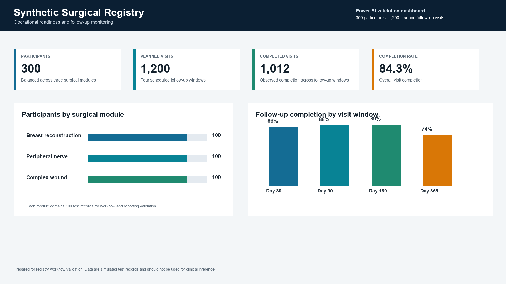

# Synthetic Surgical Registry Power BI Dashboard

Professional Power BI dashboard for a simulated surgical registry. The report is designed for operational monitoring, follow-up tracking, adverse event review, and data quality oversight across three registry modules.



## Project Overview

This project presents a structured registry dashboard built in Power BI Project format (`.pbip`). It uses simulated data only and does not contain real patient records, MIMIC-IV data, or restricted clinical source data.

The dashboard is organized into two report pages:

- **Registry Operations**: participant volume, follow-up completion, planned visits, event records, module distribution, and visit-window performance.
- **Data Quality & Review Queue**: challenge queries, missing-cell checks, serious event flags, field completeness, review status, and rule-level quality signals.

## Repository Structure

```text
.
├── assets/
│   └── dashboard-preview.png
├── data/
│   └── processed/
│       ├── ae_by_cohort.csv
│       ├── challenge_queries_by_rule.csv
│       ├── cohort_counts.csv
│       ├── field_completeness.csv
│       └── followup_by_cohort.csv
├── docs/
│   ├── DATA_DICTIONARY.md
│   └── OPENING_GUIDE.md
├── pipeline/
│   ├── 01_schema.sql
│   ├── 02_quality_checks.sql
│   ├── README.md
│   └── build_registry_dataset.py
└── powerbi/
    ├── Project4_Final_Dashboard.pbip
    ├── Project4_Final_Dashboard.Report/
    └── Project4_Final_Dashboard.SemanticModel/
```

## How To Open

1. Open `powerbi/Project4_Final_Dashboard.pbip` in Power BI Desktop.
2. If Power BI asks to apply project changes, choose **Apply**.
3. If Power BI shows a data warning, use **Home > Refresh**.
4. Review both pages: **Registry Operations** and **Data Quality & Review Queue**.

## Dashboard Scope

The dashboard supports:

- high-level registry performance review;
- follow-up completion monitoring;
- adverse event and serious event tracking;
- challenge-query monitoring;
- missingness and field-completeness review;
- presentation-ready registry reporting.

## Data Pipeline

The `pipeline/` folder documents how the registry dataset is structured, checked, and summarized before reporting:

- `01_schema.sql` defines the relational registry tables.
- `02_quality_checks.sql` contains reusable validation checks for missingness, follow-up status, event notification, and module consistency.
- `build_registry_dataset.py` creates deterministic synthetic registry records and exports the processed summary tables used by the dashboard.

The processed CSV outputs are included under `data/processed/` for transparent review.

## Data Summary

- 300 simulated participant records
- 3 registry modules
- 1,200 planned follow-up visits
- 1,012 completed follow-up visits
- 52 event records
- 5 serious event flags
- 30 challenge queries

## Notes

This is a review-ready analytics project using synthetic registry data. It is suitable for portfolio review, dashboard design review, and workflow discussion, but not for clinical inference.
